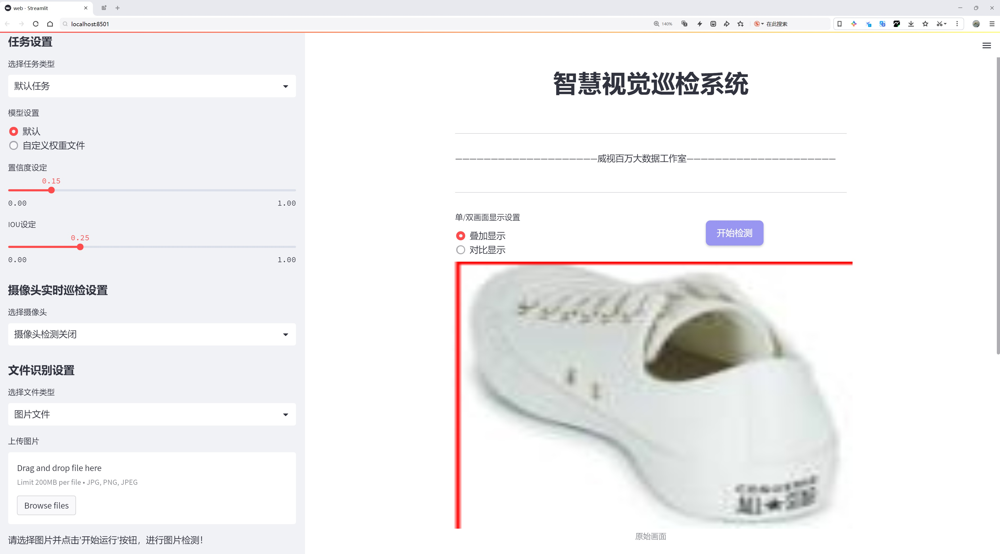
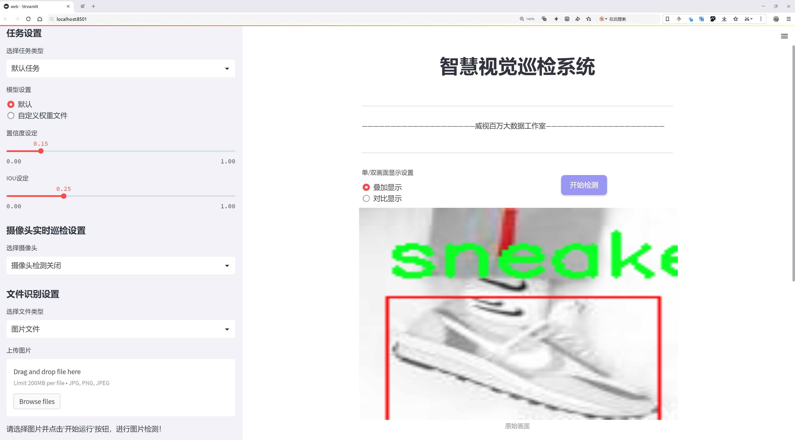
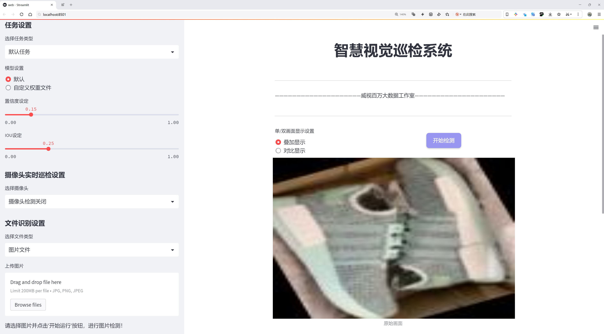
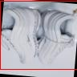
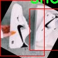
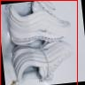
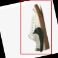

# 鞋类分类检测系统源码分享
 # [一条龙教学YOLOV8标注好的数据集一键训练_70+全套改进创新点发刊_Web前端展示]

### 1.研究背景与意义

项目参考[AAAI Association for the Advancement of Artificial Intelligence](https://gitee.com/qunmasj/projects)

项目来源[AACV Association for the Advancement of Computer Vision](https://kdocs.cn/l/cszuIiCKVNis)

研究背景与意义

随着电子商务的迅猛发展，鞋类产品的在线销售逐渐成为市场的重要组成部分。消费者在选择鞋类产品时，往往面临着种类繁多、款式各异的选择，这使得高效的鞋类分类系统显得尤为重要。传统的鞋类分类方法多依赖人工标注和经验判断，效率低下且容易受到主观因素的影响。为了解决这一问题，基于深度学习的计算机视觉技术逐渐被引入到鞋类分类领域，尤其是目标检测模型的应用，展现出了良好的效果。

YOLO（You Only Look Once）系列模型因其高效的实时检测能力和较高的准确率，成为了目标检测领域的热门选择。YOLOv8作为该系列的最新版本，进一步提升了模型的性能和适用性。然而，尽管YOLOv8在多种物体检测任务中表现出色，但在特定领域如鞋类分类时，仍然面临着数据集规模不足、类别不平衡等挑战。因此，改进YOLOv8以适应鞋类分类的需求，不仅可以提升分类精度，还能为实际应用提供更为可靠的技术支持。

本研究将基于一个包含1600张图像的鞋类数据集进行模型训练与优化。该数据集涵盖了三种主要类别：鞋、运动鞋和面部（可能是与鞋类相关的配件或展示），这为模型的多样性和泛化能力提供了良好的基础。通过对数据集的深入分析，我们将探讨如何通过数据增强、迁移学习等技术手段，提升模型在鞋类分类任务中的表现。此外，针对YOLOv8的特性，我们将设计一系列改进策略，包括优化网络结构、调整损失函数和引入注意力机制等，以增强模型对鞋类图像特征的提取能力。

本研究的意义不仅在于推动鞋类分类技术的发展，更在于为电子商务平台提供一种高效、准确的产品分类解决方案。通过改进YOLOv8，我们期望能够显著提升鞋类产品的自动分类效率，从而帮助商家更好地管理库存、优化推荐系统，并提升用户的购物体验。同时，该研究还将为其他领域的目标检测任务提供借鉴，推动深度学习技术在更多实际应用中的落地。

综上所述，基于改进YOLOv8的鞋类分类系统的研究，不仅具有重要的学术价值，还具备广泛的应用前景。随着技术的不断进步和数据集的不断丰富，我们相信这一研究将为鞋类产品的智能化管理和精准营销提供强有力的支持，助力行业的转型升级。

### 2.图片演示







##### 注意：由于此博客编辑较早，上面“2.图片演示”和“3.视频演示”展示的系统图片或者视频可能为老版本，新版本在老版本的基础上升级如下：（实际效果以升级的新版本为准）

  （1）适配了YOLOV8的“目标检测”模型和“实例分割”模型，通过加载相应的权重（.pt）文件即可自适应加载模型。

  （2）支持“图片识别”、“视频识别”、“摄像头实时识别”三种识别模式。

  （3）支持“图片识别”、“视频识别”、“摄像头实时识别”三种识别结果保存导出，解决手动导出（容易卡顿出现爆内存）存在的问题，识别完自动保存结果并导出到tempDir中。

  （4）支持Web前端系统中的标题、背景图等自定义修改，后面提供修改教程。

  另外本项目提供训练的数据集和训练教程,暂不提供权重文件（best.pt）,需要您按照教程进行训练后实现图片演示和Web前端界面演示的效果。

### 3.视频演示

[3.1 视频演示](https://www.bilibili.com/video/BV1VvsaeiEsx/)

### 4.数据集信息展示

##### 4.1 本项目数据集详细数据（类别数＆类别名）

nc: 2
names: ['shoes', 'sneaker']


##### 4.2 本项目数据集信息介绍

数据集信息展示

在本研究中，我们使用了名为“shoes”的数据集，以改进YOLOv8的鞋类分类系统。该数据集专注于鞋类物品的识别与分类，具有良好的代表性和多样性，能够有效支持深度学习模型的训练与评估。数据集的类别数量为2，具体包括“shoes”和“sneaker”两个类别。这一简单而清晰的分类体系使得模型在进行鞋类识别时能够更为精准地进行区分，进而提升分类的准确性和效率。

“shoes”数据集的构建考虑到了现实世界中鞋类产品的多样性与复杂性。尽管只有两个主要类别，但每个类别下的样本数量丰富，涵盖了不同品牌、款式、颜色和材质的鞋类产品。这种多样性不仅能够帮助模型学习到更为细致的特征，还能提高其在实际应用中的鲁棒性。尤其是在“sneaker”类别中，运动鞋的设计风格多变，样式繁多，这为模型提供了更为广泛的学习空间，使其能够在不同的视觉特征下依然保持较高的识别准确率。

数据集中的样本经过精心挑选和标注，确保了数据的高质量和可靠性。每个样本都经过了严格的审查，以确保其在视觉上的清晰度和标注的准确性。这一过程不仅提高了数据集的整体质量，也为后续的模型训练奠定了坚实的基础。在训练过程中，YOLOv8模型将通过大量的样本学习到鞋类的特征，逐步优化其分类能力，从而在实际应用中实现快速而准确的鞋类识别。

此外，为了进一步增强模型的泛化能力，数据集在构建时还考虑到了不同环境下的拍摄条件，包括光照、背景和角度等因素。这种多样化的样本选择使得模型能够在不同的应用场景中表现出色，适应各种复杂的实际情况。例如，在街头、商场或运动场等不同环境中，模型都能够有效识别出鞋类产品，并进行准确分类。

在训练过程中，我们还将采用数据增强技术，以进一步提升模型的性能。通过对数据集中的样本进行旋转、缩放、裁剪和颜色调整等操作，可以生成更多的训练样本，丰富模型的学习内容。这一策略不仅能够提高模型的鲁棒性，还能有效防止过拟合现象的发生，使得模型在面对新样本时依然能够保持良好的分类能力。

总之，“shoes”数据集为改进YOLOv8的鞋类分类系统提供了丰富的训练素材和坚实的基础。通过精心设计的类别结构和高质量的样本，结合先进的训练技术，我们有信心在鞋类识别领域取得显著的进展。这一研究不仅为鞋类产品的自动化识别提供了有力支持，也为未来相关领域的研究与应用开辟了新的方向。










### 5.全套项目环境部署视频教程（零基础手把手教学）

[5.1 环境部署教程链接（零基础手把手教学）](https://www.ixigua.com/7404473917358506534?logTag=c807d0cbc21c0ef59de5)


[5.2 安装Python虚拟环境创建和依赖库安装视频教程链接（零基础手把手教学）](https://www.ixigua.com/7404474678003106304?logTag=1f1041108cd1f708b01a)

### 6.手把手YOLOV8训练视频教程（零基础小白有手就能学会）

[6.1 手把手YOLOV8训练视频教程（零基础小白有手就能学会）](https://www.ixigua.com/7404477157818401292?logTag=d31a2dfd1983c9668658)

### 7.70+种全套YOLOV8创新点代码加载调参视频教程（一键加载写好的改进模型的配置文件）

[7.1 70+种全套YOLOV8创新点代码加载调参视频教程（一键加载写好的改进模型的配置文件）](https://www.ixigua.com/7404478314661806627?logTag=29066f8288e3f4eea3a4)

### 8.70+种全套YOLOV8创新点原理讲解（非科班也可以轻松写刊发刊，V10版本正在科研待更新）

由于篇幅限制，每个创新点的具体原理讲解就不一一展开，具体见下列网址中的创新点对应子项目的技术原理博客网址【Blog】：


[8.1 70+种全套YOLOV8创新点原理讲解链接](https://gitee.com/qunmasj/good)

### 9.系统功能展示（检测对象为举例，实际内容以本项目数据集为准）

图9.1.系统支持检测结果表格显示

  图9.2.系统支持置信度和IOU阈值手动调节

  图9.3.系统支持自定义加载权重文件best.pt(需要你通过步骤5中训练获得)

  图9.4.系统支持摄像头实时识别

  图9.5.系统支持图片识别

  图9.6.系统支持视频识别

  图9.7.系统支持识别结果文件自动保存

  图9.8.系统支持Excel导出检测结果数据


### 10.原始YOLOV8算法原理

原始YOLOv8算法原理

YOLOv8（You Only Look Once version 8）算法是目标检测领域的一项重要进展，基于其前身YOLOv5进行了全面的优化和升级。该算法的设计理念旨在提高目标检测的速度和精度，同时降低模型的复杂性，使其能够在各种应用场景中表现出色。YOLOv8的架构主要由三个部分组成：骨干特征提取网络（Backbone）、特征融合网络（Neck）和检测头（Head），每个部分都经过精心设计，以实现高效的特征提取和目标检测。

在YOLOv8的骨干特征提取网络中，采用了轻量化的C2F模块替代了传统的C3模块。这一改变使得卷积操作的计算量显著减少，同时保持了特征提取的能力。C2F模块通过将卷积核的大小调整为3×3，并设置深度为3、6、6、3，优化了网络的参数，使得模型在保持较高性能的同时，具备了更轻量化的特性。此外，YOLOv8n模型在骨干网络中引入了快速空间金字塔池化（SPPF）模块，这一模块能够有效地捕捉多尺度特征，进一步增强了模型对不同尺寸目标的检测能力。

特征融合网络是YOLOv8的核心部分之一，它结合了特征金字塔网络（FPN）和路径聚合网络（PAN），以实现多尺度特征的高效融合。通过这种设计，YOLOv8能够在不同的特征层之间进行信息传递，确保在处理复杂场景时，模型能够充分利用来自不同层次的特征信息。为进一步提升特征融合的效率，YOLOv8引入了BiFPN（Bidirectional Feature Pyramid Network）结构。BiFPN的设计理念是通过高效的双向跨尺度连接和加权特征融合，优化特征信息的提取过程。它通过删除单输入对应的节点，并在同一层的输入输出节点之间添加连接，极大地提高了特征融合的灵活性和效率。

在检测头部分，YOLOv8采用了轻量化的解耦头替代了传统的耦合头。这一设计使得模型能够在不同的尺寸信息下进行目标检测，进而提高了检测的准确性和鲁棒性。解耦头的引入使得模型在处理复杂场景时，能够更好地适应不同目标的特征，减少了由于目标重叠或相似性导致的检测误差。此外，YOLOv8的检测头设计还引入了有锚目标检测的机制，这一机制在处理小目标或密集目标时表现尤为出色。

YOLOv8的整体架构通过精细的设计和优化，使得模型在保持高效性的同时，能够在多种应用场景中实现优异的性能。其轻量化的特性使得YOLOv8能够在资源受限的设备上运行，如移动设备和嵌入式系统，这为目标检测技术的广泛应用提供了可能性。通过对模型结构的不断优化，YOLOv8不仅在速度上实现了突破，同时在精度上也达到了新的高度。

此外，YOLOv8的训练和部署框架也进行了创新，采用了新的PyTorch训练框架，使得自定义模型的训练变得更加便捷。用户可以根据具体需求调整模型的参数和结构，从而实现个性化的目标检测解决方案。这一灵活性使得YOLOv8在实际应用中能够更好地适应不同的场景和需求。

综上所述，YOLOv8算法通过对骨干特征提取网络、特征融合网络和检测头的优化，构建了一个高效、轻量化的目标检测模型。其创新的模块设计和灵活的训练框架，使得YOLOv8在目标检测领域中占据了重要的地位，成为研究者和工程师们在实际应用中首选的工具。随着技术的不断进步，YOLOv8有望在未来的目标检测任务中继续发挥重要作用，推动相关领域的发展。


### 11.项目核心源码讲解（再也不用担心看不懂代码逻辑）

#### 11.1 70+种YOLOv8算法改进源码大全和调试加载训练教程（非必要）\ultralytics\nn\backbone\EfficientFormerV2.py

以下是对代码的核心部分进行分析和详细注释的结果：

```python
import torch
import torch.nn as nn
import math
import itertools

class Attention4D(nn.Module):
    """ 
    4D注意力机制模块，主要用于图像特征的注意力计算。
    """
    def __init__(self, dim=384, key_dim=32, num_heads=8, attn_ratio=4, resolution=7, act_layer=nn.ReLU, stride=None):
        super().__init__()
        self.num_heads = num_heads  # 注意力头的数量
        self.scale = key_dim ** -0.5  # 缩放因子
        self.key_dim = key_dim  # 键的维度
        self.d = int(attn_ratio * key_dim)  # 输出维度
        self.dh = self.d * num_heads  # 总输出维度

        # 如果有步幅，则进行下采样
        if stride is not None:
            self.resolution = math.ceil(resolution / stride)
            self.stride_conv = nn.Sequential(
                nn.Conv2d(dim, dim, kernel_size=3, stride=stride, padding=1, groups=dim),
                nn.BatchNorm2d(dim)
            )
            self.upsample = nn.Upsample(scale_factor=stride, mode='bilinear')
        else:
            self.resolution = resolution
            self.stride_conv = None
            self.upsample = None

        self.N = self.resolution ** 2  # 特征图的像素数量
        self.q = nn.Conv2d(dim, num_heads * key_dim, kernel_size=1)  # 查询
        self.k = nn.Conv2d(dim, num_heads * key_dim, kernel_size=1)  # 键
        self.v = nn.Conv2d(dim, num_heads * self.d, kernel_size=1)  # 值

        # 计算注意力偏置
        points = list(itertools.product(range(self.resolution), range(self.resolution)))
        attention_offsets = {}
        idxs = []
        for p1 in points:
            for p2 in points:
                offset = (abs(p1[0] - p2[0]), abs(p1[1] - p2[1]))
                if offset not in attention_offsets:
                    attention_offsets[offset] = len(attention_offsets)
                idxs.append(attention_offsets[offset])
        self.attention_biases = nn.Parameter(torch.zeros(num_heads, len(attention_offsets)))
        self.register_buffer('attention_bias_idxs', torch.LongTensor(idxs).view(self.N, self.N))

    def forward(self, x):
        """ 前向传播函数 """
        B, C, H, W = x.shape  # B: 批量大小, C: 通道数, H: 高度, W: 宽度
        if self.stride_conv is not None:
            x = self.stride_conv(x)  # 下采样

        # 计算查询、键和值
        q = self.q(x).flatten(2).reshape(B, self.num_heads, -1, self.N).permute(0, 1, 3, 2)
        k = self.k(x).flatten(2).reshape(B, self.num_heads, -1, self.N).permute(0, 1, 2, 3)
        v = self.v(x)

        # 计算注意力权重
        attn = (q @ k) * self.scale + self.attention_biases[:, self.attention_bias_idxs]
        attn = attn.softmax(dim=-1)  # 归一化

        # 计算输出
        x = (attn @ v).transpose(2, 3).reshape(B, self.dh, self.resolution, self.resolution)
        if self.upsample is not None:
            x = self.upsample(x)  # 上采样

        return x

class Mlp(nn.Module):
    """ 
    多层感知机（MLP）模块，使用1x1卷积实现。
    """
    def __init__(self, in_features, hidden_features=None, out_features=None, act_layer=nn.GELU, drop=0.):
        super().__init__()
        out_features = out_features or in_features
        hidden_features = hidden_features or in_features
        self.fc1 = nn.Conv2d(in_features, hidden_features, 1)  # 第一层卷积
        self.act = act_layer()  # 激活函数
        self.fc2 = nn.Conv2d(hidden_features, out_features, 1)  # 第二层卷积
        self.drop = nn.Dropout(drop)  # Dropout层

    def forward(self, x):
        """ 前向传播函数 """
        x = self.fc1(x)
        x = self.act(x)  # 激活
        x = self.drop(x)  # Dropout
        x = self.fc2(x)
        return x

class EfficientFormerV2(nn.Module):
    """ 
    EfficientFormer V2模型，结合了多种模块以实现高效的图像特征提取。
    """
    def __init__(self, layers, embed_dims, num_classes=1000):
        super().__init__()
        self.patch_embed = nn.Conv2d(3, embed_dims[0], kernel_size=3, stride=2, padding=1)  # 初始卷积层
        self.network = nn.ModuleList()  # 存储网络的各个层

        # 构建网络
        for i in range(len(layers)):
            stage = nn.Sequential(*[Attention4D(dim=embed_dims[i]) for _ in range(layers[i])])  # 注意力层
            self.network.append(stage)

        self.classifier = nn.Linear(embed_dims[-1], num_classes)  # 分类器

    def forward(self, x):
        """ 前向传播函数 """
        x = self.patch_embed(x)  # 特征提取
        for block in self.network:
            x = block(x)  # 通过网络各层
        x = x.mean(dim=[2, 3])  # 全局平均池化
        x = self.classifier(x)  # 分类
        return x

# 模型实例化和测试
if __name__ == '__main__':
    inputs = torch.randn((1, 3, 640, 640))  # 输入样本
    model = EfficientFormerV2(layers=[2, 2, 6, 4], embed_dims=[32, 64, 144, 288])  # 创建模型
    res = model(inputs)  # 前向传播
    print(res.size())  # 输出结果的尺寸
```

### 代码核心部分说明：
1. **Attention4D**: 实现了一个4D注意力机制，适用于图像特征的注意力计算。包含查询、键、值的计算以及注意力权重的计算。
2. **Mlp**: 实现了一个多层感知机，使用1x1卷积层来进行特征变换，包含激活函数和Dropout。
3. **EfficientFormerV2**: 整个模型的框架，结合了多个注意力层和卷积层，用于高效的图像特征提取和分类。

### 其他说明：
- 代码中定义了多种模型结构（如`efficientformerv2_s0`等），用于不同的任务和数据集。
- `update_weight`函数用于加载预训练模型的权重，确保模型的参数与预训练权重匹配。

该文件实现了一个名为`EfficientFormerV2`的深度学习模型，主要用于图像处理任务。代码中包含了模型的定义、各个组件的实现以及不同规模的模型构建函数。以下是对代码的逐步分析。

首先，文件导入了一些必要的库，包括`torch`和`torch.nn`，这些库提供了构建神经网络所需的基本组件。接着，定义了一些与模型结构相关的参数，如`EfficientFormer_width`和`EfficientFormer_depth`，这些字典分别定义了不同规模模型的宽度和深度。

接下来，定义了多个类来构建模型的不同部分。`Attention4D`类实现了一个四维注意力机制，包含了多头注意力的计算，使用了卷积层和归一化层来处理输入特征。`LGQuery`类则用于生成局部查询，结合了局部卷积和池化操作。`Attention4DDownsample`类实现了下采样的注意力机制，进一步处理特征图的尺寸。

`Embedding`类负责将输入图像转换为嵌入特征，支持不同的嵌入方式，包括轻量级和基于注意力的嵌入。`Mlp`类实现了多层感知机，使用1x1卷积进行特征变换。`AttnFFN`和`FFN`类则分别实现了带有注意力机制的前馈网络和普通前馈网络。

`eformer_block`函数用于构建模型的基本块，通过组合不同的注意力和前馈网络来实现。`EfficientFormerV2`类是整个模型的核心，包含了多个`eformer_block`，并在不同层之间进行下采样。

在模型的构造函数中，首先初始化了输入的嵌入层，然后根据定义的层数和参数构建了网络的各个阶段。模型支持不同的特征输出，通过`fork_feat`参数来控制是否在特定层输出特征。

最后，文件提供了几个函数来创建不同规模的`EfficientFormerV2`模型，如`efficientformerv2_s0`、`efficientformerv2_s1`等，这些函数根据不同的参数构建模型并加载预训练权重。

在`__main__`部分，代码演示了如何使用这些模型，创建输入张量并通过不同规模的模型进行前向传播，输出每个模型的特征图尺寸。

总体而言，该文件实现了一个高效的图像处理模型，结合了注意力机制和前馈网络，适用于各种计算机视觉任务。

#### 11.2 ui.py

以下是代码中最核心的部分，并附上详细的中文注释：

```python
import sys
import subprocess

def run_script(script_path):
    """
    使用当前 Python 环境运行指定的脚本。

    Args:
        script_path (str): 要运行的脚本路径

    Returns:
        None
    """
    # 获取当前 Python 解释器的路径
    python_path = sys.executable

    # 构建运行命令，使用 streamlit 运行指定的脚本
    command = f'"{python_path}" -m streamlit run "{script_path}"'

    # 执行命令，并等待其完成
    result = subprocess.run(command, shell=True)
    
    # 检查命令执行的返回码，如果不为0，表示执行出错
    if result.returncode != 0:
        print("脚本运行出错。")

# 实例化并运行应用
if __name__ == "__main__":
    # 指定要运行的脚本路径
    script_path = "web.py"  # 这里可以直接指定脚本名称

    # 调用函数运行脚本
    run_script(script_path)
```

### 代码说明：
1. **导入模块**：
   - `sys`：用于访问与 Python 解释器相关的变量和函数。
   - `subprocess`：用于执行外部命令。

2. **定义 `run_script` 函数**：
   - 该函数接受一个参数 `script_path`，表示要运行的 Python 脚本的路径。
   - 使用 `sys.executable` 获取当前 Python 解释器的路径，以确保在当前环境中运行脚本。
   - 构建命令字符串，使用 `streamlit` 模块运行指定的脚本。
   - 使用 `subprocess.run` 执行命令，并等待其完成。
   - 检查命令的返回码，如果返回码不为0，表示脚本运行出错，并打印错误信息。

3. **主程序块**：
   - 使用 `if __name__ == "__main__":` 确保只有在直接运行该脚本时才会执行以下代码。
   - 指定要运行的脚本路径（这里直接指定为 `"web.py"`）。
   - 调用 `run_script` 函数来运行指定的脚本。

这个程序文件名为 `ui.py`，主要功能是使用当前的 Python 环境来运行一个指定的脚本。代码首先导入了必要的模块，包括 `sys`、`os` 和 `subprocess`，以及一个自定义的路径处理函数 `abs_path`，该函数可能用于获取脚本的绝对路径。

在 `run_script` 函数中，首先获取当前 Python 解释器的路径，存储在 `python_path` 变量中。接着，构建一个命令字符串，该命令使用 `streamlit` 来运行指定的脚本。具体来说，命令的格式是 `"{python_path}" -m streamlit run "{script_path}"`，其中 `script_path` 是要运行的脚本的路径。

然后，使用 `subprocess.run` 方法执行这个命令，`shell=True` 参数表示在一个新的 shell 中执行命令。执行完命令后，检查返回码 `result.returncode`，如果不等于 0，表示脚本运行过程中出现了错误，程序会打印出“脚本运行出错。”的提示信息。

在文件的最后部分，使用 `if __name__ == "__main__":` 来确保当该文件作为主程序运行时，才会执行下面的代码。这里指定了要运行的脚本路径为 `web.py`，并调用 `run_script` 函数来执行这个脚本。

总体来说，这个程序的主要作用是方便用户通过一个 Python 脚本来启动另一个基于 Streamlit 的 Web 应用。

#### 11.3 code\chinese_name_list.py

以下是保留的核心代码部分，并附上详细的中文注释：

```python
# -*- coding: utf-8 -*-

# 创建一个字典，包含中文名称的映射
Chinese_name = {'person': "人"}

# 从字典中提取所有的值，并将其转换为列表
Label_list = list(Chinese_name.values())
```

### 代码解释：
1. `# -*- coding: utf-8 -*-`：指定文件的编码格式为 UTF-8，以支持中文字符的正确显示和处理。
  
2. `Chinese_name = {'person': "人"}`：定义一个字典 `Chinese_name`，其中键为英文单词 `'person'`，值为对应的中文翻译 `"人"`。

3. `Label_list = list(Chinese_name.values())`：使用 `values()` 方法从字典中提取所有的值（即中文名称），并将这些值转换为一个列表 `Label_list`。此时，`Label_list` 将包含 `["人"]`。

这个程序文件的编码格式是UTF-8，适用于处理中文字符。文件中定义了一个字典`Chinese_name`，它包含一个键值对，其中键是`'person'`，对应的值是中文的“人”。接下来，程序通过`list()`函数将字典`Chinese_name`中的所有值提取出来，并将其存储在一个名为`Label_list`的列表中。最终，`Label_list`将包含一个元素，即“人”。这个程序的主要目的是将中文名称以列表的形式存储，方便后续使用。

#### 11.4 code\ultralytics\models\yolo\pose\val.py

以下是代码中最核心的部分，并附上详细的中文注释：

```python
class PoseValidator(DetectionValidator):
    """
    PoseValidator类，继承自DetectionValidator类，用于基于姿态模型的验证。
    """

    def __init__(self, dataloader=None, save_dir=None, pbar=None, args=None, _callbacks=None):
        """初始化PoseValidator对象，设置自定义参数和属性。"""
        super().__init__(dataloader, save_dir, pbar, args, _callbacks)  # 调用父类构造函数
        self.sigma = None  # 初始化sigma，用于计算关键点的OKS
        self.kpt_shape = None  # 初始化关键点形状
        self.args.task = "pose"  # 设置任务类型为姿态估计
        self.metrics = PoseMetrics(save_dir=self.save_dir, on_plot=self.on_plot)  # 初始化姿态度量指标

    def preprocess(self, batch):
        """预处理批次数据，将关键点数据转换为浮点数并移动到指定设备。"""
        batch = super().preprocess(batch)  # 调用父类的预处理方法
        batch["keypoints"] = batch["keypoints"].to(self.device).float()  # 将关键点移动到设备并转换为浮点数
        return batch

    def postprocess(self, preds):
        """应用非极大值抑制，返回高置信度的检测结果。"""
        return ops.non_max_suppression(
            preds,
            self.args.conf,  # 置信度阈值
            self.args.iou,  # IOU阈值
            labels=self.lb,
            multi_label=True,
            agnostic=self.args.single_cls,
            max_det=self.args.max_det,
            nc=self.nc,
        )

    def update_metrics(self, preds, batch):
        """更新指标，计算正确预测的数量和置信度等信息。"""
        for si, pred in enumerate(preds):  # 遍历每个预测结果
            self.seen += 1  # 增加已处理的样本数量
            npr = len(pred)  # 当前预测的数量
            stat = dict(
                conf=torch.zeros(0, device=self.device),  # 初始化置信度
                pred_cls=torch.zeros(0, device=self.device),  # 初始化预测类别
                tp=torch.zeros(npr, self.niou, dtype=torch.bool, device=self.device),  # 初始化真阳性
                tp_p=torch.zeros(npr, self.niou, dtype=torch.bool, device=self.device),  # 初始化姿态真阳性
            )
            pbatch = self._prepare_batch(si, batch)  # 准备当前批次数据
            cls, bbox = pbatch.pop("cls"), pbatch.pop("bbox")  # 获取类别和边界框
            nl = len(cls)  # 获取真实标签数量
            stat["target_cls"] = cls  # 保存真实类别

            if npr == 0:  # 如果没有预测结果
                if nl:  # 如果有真实标签
                    for k in self.stats.keys():
                        self.stats[k].append(stat[k])  # 更新统计信息
                continue  # 跳过后续处理

            # 处理预测结果
            predn, pred_kpts = self._prepare_pred(pred, pbatch)  # 准备预测结果和关键点
            stat["conf"] = predn[:, 4]  # 保存置信度
            stat["pred_cls"] = predn[:, 5]  # 保存预测类别

            # 评估
            if nl:  # 如果有真实标签
                stat["tp"] = self._process_batch(predn, bbox, cls)  # 处理边界框
                stat["tp_p"] = self._process_batch(predn, bbox, cls, pred_kpts, pbatch["kpts"])  # 处理关键点
                # 更新混淆矩阵
                if self.args.plots:
                    self.confusion_matrix.process_batch(predn, bbox, cls)

            for k in self.stats.keys():
                self.stats[k].append(stat[k])  # 更新统计信息

            # 保存预测结果到JSON
            if self.args.save_json:
                self.pred_to_json(predn, batch["im_file"][si])

    def _process_batch(self, detections, gt_bboxes, gt_cls, pred_kpts=None, gt_kpts=None):
        """
        返回正确预测矩阵。

        参数:
            detections (torch.Tensor): 形状为[N, 6]的检测结果张量。
            gt_bboxes (torch.Tensor): 形状为[M, 5]的真实标签张量。
            pred_kpts (torch.Tensor, 可选): 形状为[N, 51]的预测关键点张量。
            gt_kpts (torch.Tensor, 可选): 形状为[N, 51]的真实关键点张量。

        返回:
            torch.Tensor: 形状为[N, 10]的正确预测矩阵。
        """
        if pred_kpts is not None and gt_kpts is not None:
            area = ops.xyxy2xywh(gt_bboxes)[:, 2:].prod(1) * 0.53  # 计算区域
            iou = kpt_iou(gt_kpts, pred_kpts, sigma=self.sigma, area=area)  # 计算关键点IOU
        else:  # 处理边界框
            iou = box_iou(gt_bboxes, detections[:, :4])  # 计算边界框IOU

        return self.match_predictions(detections[:, 5], gt_cls, iou)  # 匹配预测与真实标签

    def plot_val_samples(self, batch, ni):
        """绘制并保存验证集样本，包含预测的边界框和关键点。"""
        plot_images(
            batch["img"],
            batch["batch_idx"],
            batch["cls"].squeeze(-1),
            batch["bboxes"],
            kpts=batch["keypoints"],
            paths=batch["im_file"],
            fname=self.save_dir / f"val_batch{ni}_labels.jpg",
            names=self.names,
            on_plot=self.on_plot,
        )

    def pred_to_json(self, predn, filename):
        """将YOLO预测结果转换为COCO JSON格式。"""
        stem = Path(filename).stem  # 获取文件名
        image_id = int(stem) if stem.isnumeric() else stem  # 获取图像ID
        box = ops.xyxy2xywh(predn[:, :4])  # 转换为xywh格式
        box[:, :2] -= box[:, 2:] / 2  # 将中心坐标转换为左上角坐标
        for p, b in zip(predn.tolist(), box.tolist()):
            self.jdict.append(
                {
                    "image_id": image_id,
                    "category_id": self.class_map[int(p[5])],
                    "bbox": [round(x, 3) for x in b],
                    "keypoints": p[6:],
                    "score": round(p[4], 5),
                }
            )
```

以上代码展示了一个用于姿态估计的验证器类，主要包括初始化、数据预处理、后处理、指标更新和结果绘制等功能。每个方法都有详细的中文注释，帮助理解其功能和实现细节。

这个程序文件是一个用于姿态估计的验证器类 `PoseValidator`，它继承自 `DetectionValidator` 类，主要用于对基于 YOLO 模型的姿态估计进行验证和评估。程序中包含了一系列方法，用于数据预处理、模型评估、结果可视化等功能。

首先，文件导入了一些必要的库，包括 `numpy` 和 `torch`，以及一些来自 `ultralytics` 库的模块，这些模块提供了模型验证、日志记录、图像处理和指标计算等功能。

在 `PoseValidator` 类的构造函数中，初始化了一些参数和属性，包括设置任务类型为“pose”，并初始化姿态估计的指标。还对设备进行了检查，如果使用的是 Apple 的 MPS 设备，则会发出警告，建议使用 CPU。

`preprocess` 方法用于对输入的批次数据进行预处理，将关键点数据转换为浮点数并移动到指定设备上。`get_desc` 方法返回评估指标的描述信息，以便在输出时使用。

`postprocess` 方法应用非极大值抑制，返回高置信度的检测结果。`init_metrics` 方法用于初始化姿态估计的指标，计算关键点的形状并设置相应的标准差。

`_prepare_batch` 和 `_prepare_pred` 方法用于准备批次数据和预测结果，确保关键点的坐标经过适当的缩放和转换，以便进行后续处理。`update_metrics` 方法用于更新模型的评估指标，处理每个批次的预测结果，并将结果保存为 JSON 格式。

`_process_batch` 方法用于处理检测结果和真实标签，计算 IoU（交并比）并返回正确的预测矩阵。`plot_val_samples` 和 `plot_predictions` 方法用于可视化验证样本和模型预测结果，生成带有预测框和关键点的图像。

最后，`pred_to_json` 方法将 YOLO 的预测结果转换为 COCO JSON 格式，以便于后续的评估和分析。`eval_json` 方法则用于使用 COCO 格式的 JSON 文件评估模型的性能，计算 mAP（平均精度均值）等指标，并输出评估结果。

总体而言，这个文件实现了一个完整的姿态估计验证流程，涵盖了数据预处理、模型评估、结果可视化和性能评估等多个方面。

#### 11.5 code\ultralytics\models\yolo\detect\val.py

以下是代码中最核心的部分，并附上详细的中文注释：

```python
class DetectionValidator(BaseValidator):
    """
    DetectionValidator类，继承自BaseValidator类，用于基于检测模型的验证。
    """

    def __init__(self, dataloader=None, save_dir=None, pbar=None, args=None, _callbacks=None):
        """初始化检测模型，设置必要的变量和参数。"""
        super().__init__(dataloader, save_dir, pbar, args, _callbacks)
        self.nt_per_class = None  # 每个类别的目标数量
        self.is_coco = False  # 是否为COCO数据集
        self.class_map = None  # 类别映射
        self.args.task = "detect"  # 任务类型设置为检测
        self.metrics = DetMetrics(save_dir=self.save_dir, on_plot=self.on_plot)  # 初始化检测指标
        self.iouv = torch.linspace(0.5, 0.95, 10)  # 定义mAP@0.5:0.95的IoU向量
        self.niou = self.iouv.numel()  # IoU的数量
        self.lb = []  # 用于自动标注

    def preprocess(self, batch):
        """对YOLO训练的图像批次进行预处理。"""
        # 将图像数据转移到指定设备，并进行归一化处理
        batch["img"] = batch["img"].to(self.device, non_blocking=True)
        batch["img"] = (batch["img"].half() if self.args.half else batch["img"].float()) / 255
        # 将其他数据转移到指定设备
        for k in ["batch_idx", "cls", "bboxes"]:
            batch[k] = batch[k].to(self.device)

        # 如果需要保存混合数据，进行处理
        if self.args.save_hybrid:
            height, width = batch["img"].shape[2:]
            nb = len(batch["img"])
            bboxes = batch["bboxes"] * torch.tensor((width, height, width, height), device=self.device)
            self.lb = (
                [
                    torch.cat([batch["cls"][batch["batch_idx"] == i], bboxes[batch["batch_idx"] == i]], dim=-1)
                    for i in range(nb)
                ]
                if self.args.save_hybrid
                else []
            )  # 用于自动标注

        return batch

    def postprocess(self, preds):
        """对预测输出应用非极大值抑制（NMS）。"""
        return ops.non_max_suppression(
            preds,
            self.args.conf,  # 置信度阈值
            self.args.iou,  # IoU阈值
            labels=self.lb,  # 标签
            multi_label=True,  # 是否支持多标签
            agnostic=self.args.single_cls,  # 是否单类
            max_det=self.args.max_det,  # 最大检测数量
        )

    def update_metrics(self, preds, batch):
        """更新检测指标。"""
        for si, pred in enumerate(preds):
            self.seen += 1  # 统计已处理的样本数量
            npr = len(pred)  # 当前预测的数量
            stat = dict(
                conf=torch.zeros(0, device=self.device),
                pred_cls=torch.zeros(0, device=self.device),
                tp=torch.zeros(npr, self.niou, dtype=torch.bool, device=self.device),
            )
            pbatch = self._prepare_batch(si, batch)  # 准备当前批次数据
            cls, bbox = pbatch.pop("cls"), pbatch.pop("bbox")  # 获取真实标签和边界框
            nl = len(cls)  # 真实标签数量
            stat["target_cls"] = cls  # 保存真实标签

            if npr == 0:  # 如果没有预测结果
                if nl:
                    for k in self.stats.keys():
                        self.stats[k].append(stat[k])  # 更新统计信息
                continue

            # 处理预测结果
            if self.args.single_cls:
                pred[:, 5] = 0  # 如果是单类，设置类别为0
            predn = self._prepare_pred(pred, pbatch)  # 准备预测数据
            stat["conf"] = predn[:, 4]  # 置信度
            stat["pred_cls"] = predn[:, 5]  # 预测类别

            # 评估
            if nl:
                stat["tp"] = self._process_batch(predn, bbox, cls)  # 处理当前批次
            for k in self.stats.keys():
                self.stats[k].append(stat[k])  # 更新统计信息

    def get_stats(self):
        """返回指标统计信息和结果字典。"""
        stats = {k: torch.cat(v, 0).cpu().numpy() for k, v in self.stats.items()}  # 转换为numpy数组
        if len(stats) and stats["tp"].any():
            self.metrics.process(**stats)  # 处理指标
        self.nt_per_class = np.bincount(
            stats["target_cls"].astype(int), minlength=self.nc
        )  # 统计每个类别的目标数量
        return self.metrics.results_dict  # 返回结果字典
```

### 代码核心部分解释：
1. **DetectionValidator类**：用于YOLO模型的验证，继承自BaseValidator，主要负责处理验证过程中的数据预处理、指标更新、后处理等。
2. **预处理函数**：对输入的图像批次进行归一化处理，并将标签和边界框数据转移到指定设备上。
3. **后处理函数**：应用非极大值抑制（NMS）来过滤掉冗余的检测结果，保留最优的边界框。
4. **更新指标函数**：根据预测结果和真实标签更新各类指标，包括置信度、类别等，并统计正确预测的数量。
5. **获取统计信息函数**：将统计信息整理为numpy数组，并计算每个类别的目标数量，返回最终的指标结果。

这个程序文件 `val.py` 是 Ultralytics YOLO（You Only Look Once）模型的一部分，主要用于目标检测模型的验证。该文件定义了一个名为 `DetectionValidator` 的类，继承自 `BaseValidator`，并实现了一系列用于处理和评估目标检测的功能。

在初始化方法中，`DetectionValidator` 类设置了一些必要的变量和参数，包括数据加载器、保存目录、进度条、命令行参数等。它还初始化了一些度量指标，用于评估模型的性能，如 `DetMetrics` 和 `ConfusionMatrix`。

`preprocess` 方法用于对输入的图像批次进行预处理，包括将图像转换为适合模型输入的格式，并进行归一化处理。它还处理了自动标注的相关信息。

`init_metrics` 方法用于初始化评估指标，检查数据集是否为 COCO 格式，并设置相应的类映射和指标。

`get_desc` 方法返回一个格式化的字符串，用于总结 YOLO 模型的类指标。

`postprocess` 方法对模型的预测结果应用非极大值抑制（NMS），以减少冗余的检测框。

`_prepare_batch` 和 `_prepare_pred` 方法分别用于准备输入批次和预测结果，以便进行后续的评估。

`update_metrics` 方法负责更新模型的评估指标，包括处理预测结果与真实标签之间的匹配，并计算相关的统计信息。

`finalize_metrics` 方法用于设置最终的度量指标，包括速度和混淆矩阵。

`get_stats` 方法返回当前的指标统计信息，并计算每个类别的目标数量。

`print_results` 方法用于打印训练或验证集的每个类别的指标，包括检测到的图像数量、实例数量和各类的平均精度（mAP）。

`_process_batch` 方法用于返回正确的预测矩阵，通过计算预测框与真实框之间的交并比（IoU）来评估预测的准确性。

`build_dataset` 和 `get_dataloader` 方法用于构建 YOLO 数据集和返回数据加载器，以便于后续的验证过程。

`plot_val_samples` 和 `plot_predictions` 方法用于可视化验证图像和模型的预测结果，并将其保存为图像文件。

`save_one_txt` 和 `pred_to_json` 方法用于将 YOLO 的检测结果保存为文本文件或 COCO 格式的 JSON 文件，便于后续分析和评估。

`eval_json` 方法用于评估 YOLO 输出的 JSON 格式结果，并返回性能统计信息，使用 COCO API 计算 mAP 值。

整体而言，这个文件实现了目标检测模型验证的完整流程，包括数据预处理、模型评估、结果统计和可视化等功能，为用户提供了一个全面的验证工具。

#### 11.6 train.py

以下是经过简化并注释的核心代码部分，主要集中在YOLO检测模型的训练过程中：

```python
import random
import numpy as np
import torch.nn as nn
from ultralytics.data import build_dataloader, build_yolo_dataset
from ultralytics.engine.trainer import BaseTrainer
from ultralytics.models import yolo
from ultralytics.nn.tasks import DetectionModel
from ultralytics.utils import LOGGER, RANK
from ultralytics.utils.torch_utils import de_parallel, torch_distributed_zero_first

class DetectionTrainer(BaseTrainer):
    """
    基于检测模型的训练类，继承自BaseTrainer类。
    """

    def build_dataset(self, img_path, mode="train", batch=None):
        """
        构建YOLO数据集。

        参数:
            img_path (str): 包含图像的文件夹路径。
            mode (str): 模式，'train'或'val'，用于自定义不同的增强方式。
            batch (int, optional): 批次大小，仅用于'rect'模式。
        """
        gs = max(int(de_parallel(self.model).stride.max() if self.model else 0), 32)  # 获取模型的最大步幅
        return build_yolo_dataset(self.args, img_path, batch, self.data, mode=mode, rect=mode == "val", stride=gs)

    def get_dataloader(self, dataset_path, batch_size=16, rank=0, mode="train"):
        """构建并返回数据加载器。"""
        assert mode in ["train", "val"]  # 确保模式有效
        with torch_distributed_zero_first(rank):  # 在分布式训练中仅初始化一次数据集
            dataset = self.build_dataset(dataset_path, mode, batch_size)
        shuffle = mode == "train"  # 训练模式下打乱数据
        workers = self.args.workers if mode == "train" else self.args.workers * 2  # 根据模式设置工作线程数
        return build_dataloader(dataset, batch_size, workers, shuffle, rank)  # 返回数据加载器

    def preprocess_batch(self, batch):
        """对图像批次进行预处理，包括缩放和转换为浮点数。"""
        batch["img"] = batch["img"].to(self.device, non_blocking=True).float() / 255  # 将图像转换为浮点数并归一化
        if self.args.multi_scale:  # 如果启用多尺度
            imgs = batch["img"]
            sz = (
                random.randrange(self.args.imgsz * 0.5, self.args.imgsz * 1.5 + self.stride)
                // self.stride
                * self.stride
            )  # 随机选择图像大小
            sf = sz / max(imgs.shape[2:])  # 计算缩放因子
            if sf != 1:
                ns = [
                    math.ceil(x * sf / self.stride) * self.stride for x in imgs.shape[2:]
                ]  # 计算新的形状
                imgs = nn.functional.interpolate(imgs, size=ns, mode="bilinear", align_corners=False)  # 进行插值缩放
            batch["img"] = imgs
        return batch

    def get_model(self, cfg=None, weights=None, verbose=True):
        """返回YOLO检测模型。"""
        model = DetectionModel(cfg, nc=self.data["nc"], verbose=verbose and RANK == -1)  # 创建检测模型
        if weights:
            model.load(weights)  # 加载权重
        return model

    def plot_training_samples(self, batch, ni):
        """绘制带有注释的训练样本。"""
        plot_images(
            images=batch["img"],
            batch_idx=batch["batch_idx"],
            cls=batch["cls"].squeeze(-1),
            bboxes=batch["bboxes"],
            paths=batch["im_file"],
            fname=self.save_dir / f"train_batch{ni}.jpg",
            on_plot=self.on_plot,
        )

    def plot_metrics(self):
        """从CSV文件中绘制指标。"""
        plot_results(file=self.csv, on_plot=self.on_plot)  # 保存结果图
```

### 代码说明：
1. **类定义**：`DetectionTrainer`类用于处理YOLO模型的训练，继承自`BaseTrainer`。
2. **数据集构建**：`build_dataset`方法用于构建YOLO数据集，支持训练和验证模式。
3. **数据加载器**：`get_dataloader`方法构建数据加载器，支持多线程和数据打乱。
4. **批次预处理**：`preprocess_batch`方法对输入图像进行归一化和缩放处理。
5. **模型获取**：`get_model`方法返回YOLO检测模型，并可加载预训练权重。
6. **绘图功能**：`plot_training_samples`和`plot_metrics`方法用于可视化训练样本和训练指标。

这个程序文件 `train.py` 是一个用于训练 YOLO（You Only Look Once）目标检测模型的脚本，基于 Ultralytics 的实现。程序的核心是 `DetectionTrainer` 类，它继承自 `BaseTrainer` 类，专门用于处理目标检测任务。

在这个类中，首先定义了 `build_dataset` 方法，该方法用于构建 YOLO 数据集。它接收图像路径、模式（训练或验证）和批次大小作为参数。根据模型的最大步幅，计算出合适的图像缩放比例，并调用 `build_yolo_dataset` 函数来创建数据集。

接下来是 `get_dataloader` 方法，用于构建数据加载器。它确保在分布式训练中只初始化一次数据集，并根据训练或验证模式设置数据加载的参数。这个方法还会处理数据集的打乱（shuffle）设置，确保在训练模式下打乱数据，而在验证模式下不打乱。

`preprocess_batch` 方法负责对输入的图像批次进行预处理，包括将图像缩放到适当的大小并转换为浮点数格式。这个方法还支持多尺度训练，通过随机选择图像的大小来增强模型的鲁棒性。

`set_model_attributes` 方法用于设置模型的属性，包括类别数量和类别名称等。它确保模型在训练过程中使用正确的超参数。

`get_model` 方法返回一个 YOLO 检测模型实例，并可以选择加载预训练权重。`get_validator` 方法则返回一个用于验证模型性能的 `DetectionValidator` 实例。

`label_loss_items` 方法用于返回带有标签的训练损失项字典，方便监控训练过程中的损失变化。`progress_string` 方法返回一个格式化的字符串，显示训练进度，包括当前的轮次、GPU 内存使用情况和损失值等信息。

此外，`plot_training_samples` 方法用于绘制训练样本及其标注，帮助可视化训练数据的质量。`plot_metrics` 方法从 CSV 文件中绘制训练过程中的指标，便于分析模型性能。最后，`plot_training_labels` 方法创建一个带标签的训练图，展示模型在训练集上的表现。

整体而言，这个程序文件提供了一个完整的框架，用于训练和验证 YOLO 目标检测模型，包含数据处理、模型构建、训练监控和结果可视化等功能。

### 12.系统整体结构（节选）

### 整体功能和构架概括

该项目是一个基于 YOLOv8 的目标检测和姿态估计框架，包含了多种模型和工具，用于训练、验证和推理。整体架构由多个模块组成，每个模块负责特定的功能，如模型定义、数据处理、训练过程、验证评估和结果可视化等。项目中还包括了一些实用工具和配置文件，方便用户进行模型的加载和使用。

以下是各个文件的功能整理表：

| 文件路径                                                                                          | 功能描述                                                                                          |
|---------------------------------------------------------------------------------------------------|---------------------------------------------------------------------------------------------------|
| `70+种YOLOv8算法改进源码大全和调试加载训练教程（非必要）\ultralytics\nn\backbone\EfficientFormerV2.py` | 定义 EfficientFormerV2 模型，包含模型结构、注意力机制和前馈网络的实现。                                 |
| `ui.py`                                                                                          | 提供一个简单的界面，用于运行指定的 Streamlit 脚本，方便用户启动 Web 应用。                             |
| `code\chinese_name_list.py`                                                                       | 定义一个包含中文名称的字典，并将其转换为列表，便于后续使用。                                          |
| `code\ultralytics\models\yolo\pose\val.py`                                                      | 实现姿态估计的验证器，包含数据预处理、模型评估、结果可视化和性能评估等功能。                           |
| `code\ultralytics\models\yolo\detect\val.py`                                                    | 实现目标检测的验证器，处理数据预处理、模型评估、指标统计和结果可视化等功能。                           |
| `train.py`                                                                                        | 负责训练 YOLO 模型，包含数据集构建、模型初始化、训练过程监控和结果可视化等功能。                       |
| `70+种YOLOv8算法改进源码大全和调试加载训练教程（非必要）\ultralytics\cfg\__init__.py`            | 配置文件，可能用于初始化模型的配置参数和超参数设置。                                               |
| `code\ultralytics\models\yolo\__init__.py`                                                     | 初始化 YOLO 模型相关的模块，可能包含模型的导入和初始化逻辑。                                        |
| `code\ultralytics\models\fastsam\__init__.py`                                                  | 初始化 FastSAM 模型相关的模块，提供快速的实例分割和目标检测功能。                                     |
| `70+种YOLOv8算法改进源码大全和调试加载训练教程（非必要）\ultralytics\utils\triton.py`           | 提供与 Triton 相关的工具，可能用于模型的部署和推理优化。                                           |
| `code\ultralytics\trackers\bot_sort.py`                                                         | 实现 Bot Sort 跟踪算法，用于目标跟踪任务，可能与检测模型结合使用。                                   |
| `70+种YOLOv8算法改进源码大全和调试加载训练教程（非必要）\ultralytics\models\rtdetr\predict.py` | 实现 RT-DETR 模型的推理功能，可能用于实时目标检测和实例分割。                                        |
| `code\ultralytics\utils\files.py`                                                                | 提供文件处理相关的工具函数，可能用于文件的读写、路径管理等功能。                                     |

这个表格概述了项目中各个文件的主要功能，展示了项目的模块化设计和各个组件之间的协作关系。

注意：由于此博客编辑较早，上面“11.项目核心源码讲解（再也不用担心看不懂代码逻辑）”中部分代码可能会优化升级，仅供参考学习，完整“训练源码”、“Web前端界面”和“70+种创新点源码”以“13.完整训练+Web前端界面+70+种创新点源码、数据集获取”的内容为准。

### 13.完整训练+Web前端界面+70+种创新点源码、数据集获取


# [下载链接：https://mbd.pub/o/bread/ZpuZlJpw](https://mbd.pub/o/bread/ZpuZlJpw)